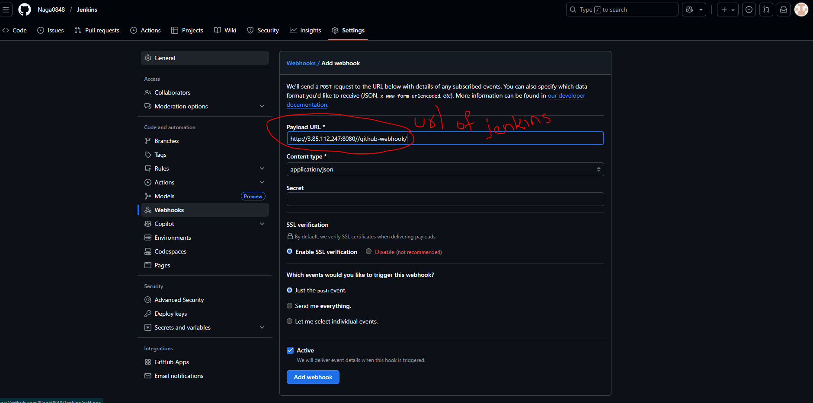

## In this repo, we will understand the basics of Jenkins

#### Commands to install Jenkins

    sudo curl -o /etc/yum.repos.d/jenkins.repo \
    https://pkg.jenkins.io/redhat-stable/jenkins.repo

    sudo rpm --import https://pkg.jenkins.io/redhat-stable/jenkins.io-2023.key
    # Add required dependencies for the jenkins package

    sudo yum install fontconfig java-21-openjdk jenkins -y
    sudo systemctl daemon-reload
    sudo systemctl start jenkins
    sudo systemctl enable jenkins

#### Shift Left Strategy

    app deploy in QA SIT UAT --> test
    PROD deploy --> testing, no scanning

    we are using shift-left strategy for our CICD pipelines, instead of testing and scanning after deploying the application in  high environment we are doing testing and scanning in DEV environment, so we can find the issues in early stages.

#### Disadvantages of Freestyle project

    freestyle pipelines --> create the pipeline in UI with some clicks.
    1. cant' restore if error comes
    2. can't track, no version control
    3. no body remember how to do it again
    4. can't re use
    5. time consuming

#### General Notes 

    Pre-Build >>>	    Build >>>		   Post-Build
    Pre production >>   production  >>     Post production    

    Pre-Build -> Options, environment, where to run
    Build --> Actual pipeline
    Post-Build -> fail, success or anything notifications

    Master Agent/Node
    =================
    Jenkins has to run different project pipelines. diff languages, diff versions, diff devices

    Jenkins master responsibility to distribute the builds to different agents. We can have more agents with diff programming languages, diff OS and diff environment. So that load will be reduced on the master. Master collects the logs from agents and monitor them.

    declrative vs scripted pipeiline
    ================================
    scripted pipeline is old, declrative is new pipeiline from jenkins-2.X
    scripted --> groovy based pipeline, feels little bit tough but you will have more control.
    declrative --> syntax is easy, entire pipeline compiles before run the pipeiline
    scripted --> compiles at the time of execution

    we are using a mix of declrative and scripted pipeiline

    GitHub Webhook
    ===============
    When developer is in feature branch, we he push the code to remote I need to immidiately trigger jenkins pipeline automatically..

    GitHub -> Jenkins

####  Understanding the Jenkins Pipeline Syntaxes

    URL to refer >>>> https://www.jenkins.io/doc/book/pipeline/syntax/

    sudo cd /var/lib/jenkins/secrets/initialAdminPassword   >>> to get the password and login to Jenkins and install the plugins

  

### Sessions Details
    79 about the scanning and also, discussed about the jenkinsfile for rollbacking the deployment in a specific env
    78 created the catalogue and its respective deployment jenkins file and created INFRA (EKS) using Terraform
    77 also about catalogue CI pipeline creation is discussed
    76 Basic Jenkinfile is discussed

#### Plugins to be installed

    Stage View   >>> Pipeline Stage View Plugin.
    AnsiColor    >>> Adds ANSI coloring to the Console Output
    Blue Ocean   >>> This plugin shows the output in a neat and clean way in all the stages step by step
    Pipeline Utility Steps >>> key reasons why this plugin is utilized is File and Archive Operations, Version Management, Workspace Manipulation and General Utility
    AWS Credentials  >>> Allows storing Amazon IAM credentials within the Jenkins Credentials API. Store Amazon IAM access keys (AWSAccessKeyId and AWSSecretKey) within the Jenkins Credentials API. Also support IAM Roles and IAM MFA Token.
    Pipeline: AWS Steps  >>> This plugins adds Jenkins pipeline steps to interact with the AWS API.
    SonarQube Scanner >>> This will enable the options for sonarqube in Jenkins

#### Steps to Launch a Jenkins Agent

    create a new ec2 instance
    In Jenkins >> Manage Jenkins >> Nodes >> Give the private IP and add the Jenkins credentials(here user is ec2-user and password is DevOps321) and give a label as well
    This agent will be launched, if the agent we mentioned here and the agent name in the Jenkinsfile i.e., pipeline matches

  
  

    Make sure Jenkins-Agent has Java, Nodejs and Docker arerunning on it...

    sudo yum install fontconfig java-21-openjdk -y

    sudo dnf module disable nodejs -y
    sudo dnf module enable nodejs:20 -y
    sudo dnf install nodejs -y

    sudo dnf -y install dnf-plugins-core
    sudo dnf config-manager --add-repo https://download.docker.com/linux/rhel/docker-ce.repo
    sudo dnf install docker-ce docker-ce-cli containerd.io docker-buildx-plugin docker-compose-plugin
    sudo systemctl restart docker
    sudo systemctl enable --now docker
    sudo usermod -aG docker ec2-user 
    exit from the agent ec2 after adding the ec2-user to the docker group and login again       

  

    In the above image we see remoting.jar which is using full for tracking the agent and using this jar file the agent connects with the master and performs the given tasks.

#### Jenkinsfile synatx
        We can modify it accordingly
     pipeline {
        agent any
        stages {
            stage('Build') {
                steps {
                    echo 'Building..'
                }
            }
            stage('Test') {
                steps {
                    echo 'Testing..'
                }
            }
            stage('Deploy') {
                steps {
                    echo 'Deploying....'
                }
            }
        }
    }    

#### Parameters
    The parameters directive provides a list of parameters that a user should provide when triggering the Pipeline. The values for these user-specified parameters are made available to Pipeline steps via the params object.
    Each parameter has a Name and Value, depending on the parameter type. This information is exported as environment variables when the build starts, allowing subsequent parts of the build configuration to access those values.

    Available Parameters
    
    pipeline {
        agent any
        parameters {
        string(name: 'PERSON', defaultValue: 'Mr Jenkins', description: 'Who should I say hello to?')

        text(name: 'BIOGRAPHY', defaultValue: '', description: 'Enter some information about the person')

        booleanParam(name: 'TOGGLE', defaultValue: true, description: 'Toggle this value')

        choice(name: 'CHOICE', choices: ['One', 'Two', 'Three'], description: 'Pick something')

        password(name: 'PASSWORD', defaultValue: 'SECRET', description: 'Enter a password')
        }
        stages {
            stage('Example') {
                steps {
                    echo "Hello ${params.PERSON}"

                    echo "Biography: ${params.BIOGRAPHY}"

                    echo "Toggle: ${params.TOGGLE}"

                    echo "Choice: ${params.CHOICE}"

                    echo "Password: ${params.PASSWORD}"
                }
            }
        }
    }

    Here we use these parameters ouside the build and to call these parameters, we use the echo "Hello ${params.PERSON}" inside any stage
    After using this parameters in the pipeline, it will start showing the Buildwithparametrs option in the console.

#### GitHub WebHooks

    https://www.blazemeter.com/blog/how-to-integrate-your-github-repository-to-your-jenkins-project   >> steps for GitHub WebHooks

    

    Here we need to use the jenkins url along with the /github-webhook/ in Payload URL for the GitHub Webhooks triggering

#### Understanding about Testing   

     testing
     ==========
     unit testing --> this should be done by developer

     functions are basic blocks of the programming

     login(username, password){
	
     }

     functional testing --> DEV
     =================
     either developers/testers

     login(username, password){
	 connectSQL()
	 checkUserName()
	 checkPassword()
     }

     integration testing --> SIT/UAT/QA
     ================
     testing team writes integration test cases
     catalogue cart
     cart is calling catalogue