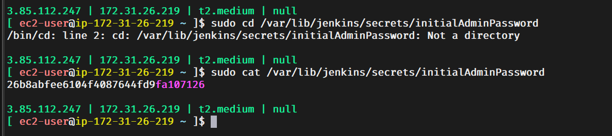
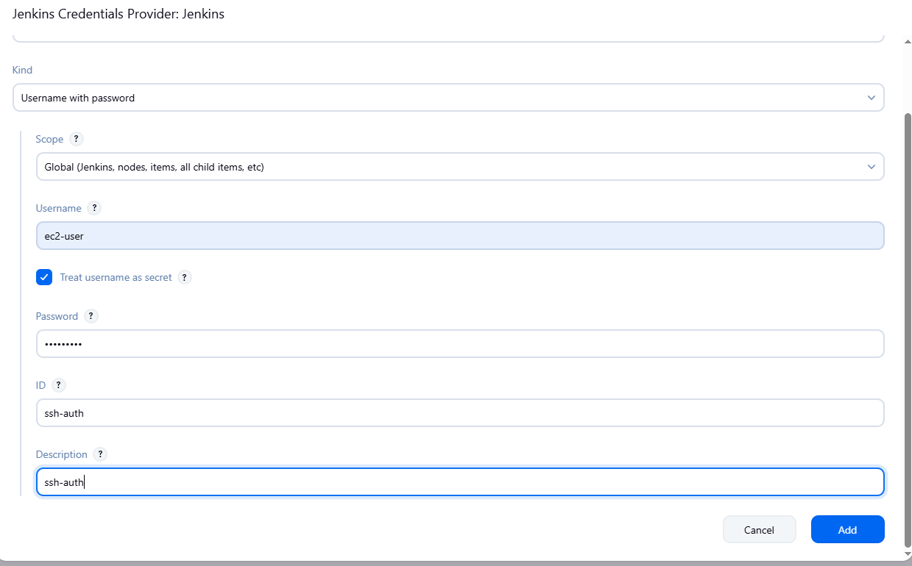
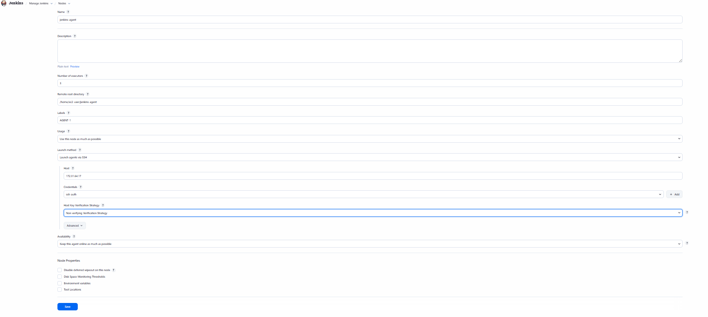
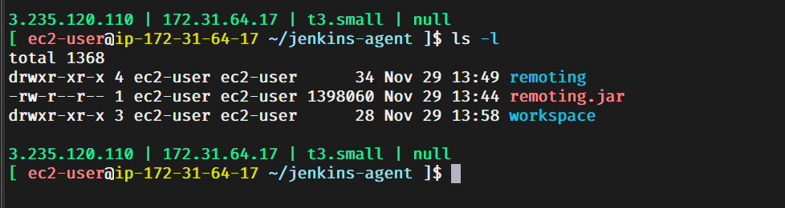

### In this repo, we will understand the basics of Jenkins

#### Commands to install Jenkins

    sudo curl -o /etc/yum.repos.d/jenkins.repo \
    https://pkg.jenkins.io/redhat-stable/jenkins.repo

    sudo rpm --import https://pkg.jenkins.io/redhat-stable/jenkins.io-2023.key
    # Add required dependencies for the jenkins package

    sudo yum install fontconfig java-21-openjdk jenkins -y
    sudo systemctl daemon-reload
    sudo systemctl start jenkins
    sudo systemctl enable jenkins

#### Shift Left Strategy

    app deploy in QA SIT UAT --> test
    PROD deploy --> testing, no scanning

    we are using shift-left strategy for our CICD pipelines, instead of testing and scanning after deploying the application in  high environment we are doing testing and scanning in DEV environment, so we can find the issues in early stages.

#### Disadvantages of Freestyle project

    freestyle pipelines --> create the pipeline in UI with some clicks.
    1. cant' restore if error comes
    2. can't track, no version control
    3. no body remember how to do it again
    4. can't re use
    5. time consuming

#### General Notes 

    Pre-Build >>>	    Build >>>		   Post-Build
    Pre production >>   production  >>     Post production    

    Pre-Build -> Options, environment, where to run
    Build --> Actual pipeline
    Post-Build -> fail, success or anything notifications

    Master Agent/Node
    =================
    Jenkins has to run different project pipelines. diff languages, diff versions, diff devices

    Jenkins master responsibility to distribute the builds to different agents. We can have more agents with diff programming languages, diff OS and diff environment. So that load will be reduced on the master. Master collects the logs from agents and monitor them.

    declrative vs scripted pipeiline
    ================================
    scripted pipeline is old, declrative is new pipeiline from jenkins-2.X
    scripted --> groovy based pipeline, feels little bit tough but you will have more control.
    declrative --> syntax is easy, entire pipeline compiles before run the pipeiline
    scripted --> compiles at the time of execution

    we are using a mix of declrative and scripted pipeiline

    GitHub Webhook
    ===============
    When developer is in feature branch, we he push the code to remote I need to immidiately trigger jenkins pipeline automatically..

    GitHub -> Jenkins

####  Understanding the Jenkins Pipeline Syntaxes

    URL to refer >>>> https://www.jenkins.io/doc/book/pipeline/syntax/

    sudo cd /var/lib/jenkins/secrets/initialAdminPassword   >>> to get the password and login to Jenkins and install the plugins

  

    

#### Plugins to be installed

    Stage View   >>> Pipeline Stage View Plugin.
    AnsiColor    >>> Adds ANSI coloring to the Console Output
    Blue Ocean   >>> This plugin shows the output in a neat and clean way in all the stages step by step

#### Steps to Launch a Jenkins Agent

    create a new ec2 instance
    In Jenkins >> Manage Jenkins >> Nodes >> Give the private IP and add the Jenkins credentials(here user is ec2-user and password is DevOps321) and give a label as well
    This agent will be launched, if the agent we mentioned here and the agent name in the Jenkinsfile i.e., pipeline matches

  
  

    Make sure Jenkins-Agent has Java running on it...

    sudo yum install fontconfig java-21-openjdk -y

  

    In the above image we see remoting.jar which is using full for tracking the agent and using this jar file the agent connects with the master and performs the given tasks.

